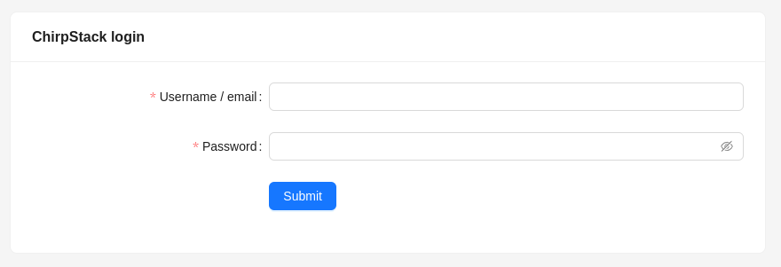
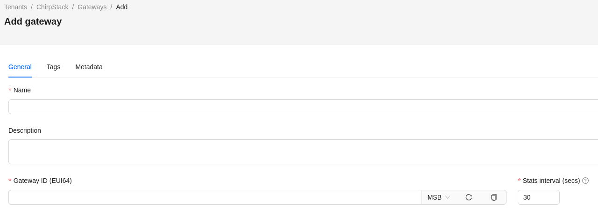

# Prerequisites

## Install tools used in development
```bash
sudo apt install clang-format
pip install pre-commit
pre-commit install
```

## Install Paho MQTT Cpp library from source
```bash
sudo apt install libpaho-mqtt-dev libpaho-mqttpp-dev
```

## Build gRPC with Protocol Buffers from source
1. Define gRPC installation directory and export variable.
```bash
export GRPC_INSTALL_DIR=$HOME/grpc_install_dir
mkdir $GRPC_INSTALL_DIR
```

2. Make sure that there is CMake version 3.13 or later. Try installing from package.
```bash
sudo apt install -y cmake
```
Check CMake version and if it is too low, install if from source.
```bash
cmake --version
```

3. Install other required packages.
```bash
sudo apt install -y build-essential autoconf libtool pkg-config
```

4. Clone gRPC repository.
```bash
git clone --recurse-submodules -b v1.64.0 --depth 1 --shallow-submodules https://github.com/grpc/grpc
```

5. Build and install gRPC and Protocol Buffers.
```bash
cd grpc
mkdir -p cmake/build
pushd cmake/build
cmake -DBUILD_SHARED_LIBS=ON \
    -DCMAKE_INSTALL_PREFIX=$GRPC_INSTALL_DIR \
    -DgRPC_BUILD_GRPC_CPP_PLUGIN=ON \
    -DgRPC_BUILD_GRPC_CSHARP_PLUGIN=OFF \
    -DgRPC_BUILD_GRPC_NODE_PLUGIN=OFF \
    -DgRPC_BUILD_GRPC_OBJECTIVE_C_PLUGIN=OFF \
    -DgRPC_BUILD_GRPC_PHP_PLUGIN=OFF \
    -DgRPC_BUILD_GRPC_PYTHON_PLUGIN=OFF \
    -DgRPC_BUILD_GRPC_RUBY_PLUGIN=OFF \
    ../..
make -j 4 # if your machine is stronger, consider increasing number of jobs or skip it altogether to run without constraints
make install
popd
```

6. Export variables to be able to load built shared libraries and include headers. It is recommended to put those variables inside `.bashrc` file.
```bash
export GRPC_INSTALL_DIR=${HOME}/grpc_install_dir
export PATH=$PATH:${GRPC_INSTALL_DIR}/bin
export LD_LIBRARY_PATH=$LD_LIBRARY_PATH:${GRPC_INSTALL_DIR}/lib
```

# Setup local deployment (optional)
Download all dependencies needed to run the bridge locally.
```bash
vcs import < local_dependencies.repos
```

## Chirpstack
There is prepared Docker based configuration in `chirpstack_docker` directory.

> [!NOTE]
> For more detailed information about Chirpstack check official documentation:
https://www.chirpstack.io/docs/getting-started/docker.html

## packer_forwarder

> [!NOTE]
> All configuration files are used in EUR868 zone. If you are running LoRaWAN devices in different
zone, please take that into account by changing configuration file.

1. Build binaries.
```bash
cd sx1302_hal
make
```

2. Find gateway ID, copy it, open configuration file (located in `packet_forwarder/global_conf.json.sx1250.EU868.USB`)
and replace gateway ID value.
```json
"gateway_ID": "REPLACE_THIS_VALUE",
```

# Build the bridge
Navigate to ROS 2 workspace and build.
```bash
colcon build --packages-up-to wisevision_lorawan_bridge
```

# How to run
## Start *packet_forwarder* executable.
```bash
cd src/wisevision_lorawan_bridge/sx1302_hal/packet_forwarder
sudo ./lora_pkt_fwd -c global_conf.json.sx1250.EU868.USB
```
> [!NOTE]
> If there are problems starting *packet_forwarder*, check the device. In configuration file it is set
to `/dev/ttyACM0`.

## Start *Chirpstack* stack.
```bash
cd chirpstack_docker
docker compose up
```

### Setup Chirpstack

1. Import devices profiles.
```bash
cd chirpstack_docker
./import_lorawan_devices.sh
```

2. Open Chirpstack dashboard panel by going to `localhost:8080` in browser.



3. Login to the panel. On the first start username is *admin* and password is *admin*.
> [!NOTE]
> It is recommended to change the password.

4. On the left side, navigate to *Gateways* under *Tenant* and add new gateway. One can add multiple of those.



Fill the name field and gateway ID.

5. Navigate to *Applications* and create one. Save `application ID` for later use.
6. Add device for the application that was just created. For that, *Device EUI* and *Device profile* is needed.
If there is no profile available for the device, one has to configure it manually.
7. If added device supports OTAA (Over-The-Air-Activation), navigate to *OTAA keys* tab for selected device
and fill *Application key* provided to device.
8. Repeat step 6-7 for all devices that one wants to see in the system.

Last step in Chirpstack UI is to obtain `CHIRPSTACK_API_KEY` needed to connect bridge to Chirpstack via MQTT.
1. Navigate to *API Keys* under current *Tenant*.
2. Add new key and give it a name.
3. Copy the value which is presented in the window and store it in `CHIRPSTACK_API_KEY` environment variable.

## Start LoRaWAN bridge

> [!NOTE]
> Change `broker.host` and `broker.port` parameters if MQTT broker is deployed on different host.

1. Source built workspace.
```bash
source install/local_setup.bash
```

2. Start bridge as standalone node.
```bash
export CHIRPSTACK_API_KEY=<API key>
ros2 run wisevision_lorawan_bridge lorawan_bridge --ros-args --param application_id:=<APPLICATION_ID> --param use_only_standard:=false
```

3. Start bridge in components container.
- start component container
```bash 
export CHIRPSTACK_API_KEY=<API key>
ros2 run rclcpp_components component_container
```
- load bridge component
```bash
ros2 component load /ComponentManager wisevision_lorawan_bridge wisevision::LoraWanBridge --parameter application_id:=<APPLICATION_ID> --parameter use_only_standard:=false
```

# LoRaWAN bridge node ROS 2 parameters
- application_id (string),
- use_only_standard (boolean),
- api.host (string),
- api.port (integer),
- mqtt_broker.host (string),
- mqtt_broker.port (integer).

